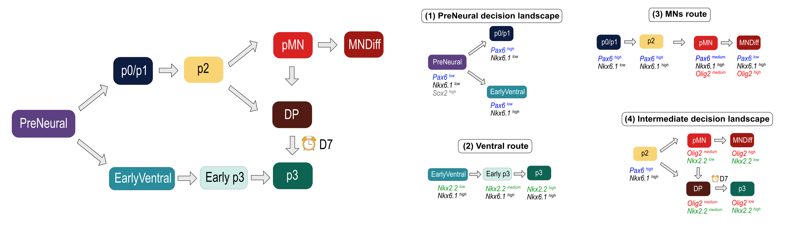

# Flow cytometry analysis

Code reproducing the flow cytometry analysis for the paper:

> M. Fontaine, J.M. Delas, M. Saez, R.J. Maizels, E. Finnie, J. Briscoe, D.A. Rand (2025).
> *Dynamic Landscape Analysis of Cell Fate Decisions: Predictive Models of Neural
> Development From Single-Cell Data*. bioRxiv. https://doi.org/10.1101/2025.05.28.656648

All the methods used here are described in **Appendix A (Data analysis)**:
https://doi.org/10.6084/m9.figshare.31342810

Cells are clustered with Gaussian Mixture Models in marker-expression space, each cluster
is assigned a cell-state identity, and the quality of that assignment is checked. The
resulting attractor clusters are then projected into LDA coordinates so the temporal
progression of each sub-landscape and route can be followed across SAG concentrations.
The proportions produced here are then averaged for each SAG concentration accross replicates and this average is what the landscape model is fitted to in
[`../FittingModel/`](../FittingModel/).



## Contents

| File | Purpose | Appendix A |
|------|---------|------------|
| `flow_functions.py` | Helper functions shared by every notebook: cell state proportions, barplots, Gaussian clusters, LDA projection and LDA plots. | Sections A1.4, A3 |
| `palette.py` | Celltype and timepoint colour palettes. | — |
| `FlowAnalysis_ConstantSAG_0_10_100_500.ipynb` | Cluster and annotate D4–D6 across the four constant-SAG conditions, check cluster quality, and visualise the sub-landscapes in LDA coordinates. | Sections A3.1–A3.3 |
| `FlowAnalysis_EarlyPulse_SAG_0_500_and_UpSAG0-500.ipynb` | The Early Pulse (SAGUP) experiment: 0 nM → 500 nM → 0 nM SAG. | Section A3.4 |
| `FlowAnalysis_TransitionsAndDecisions.ipynb` | Temporal progression of each sub-landscape and route in LDA space under SAG perturbation. | Sections A4.1–A4.3 |
| `FlowAnalysis_UpToD7_SAG500_and_UpSAG0-500.ipynb` | Extends the analysis to D7 for 500 nM SAG and Up-SAG0/500 (replicates A and B). | Sections A3.1–A3.3 |
| `requirements.txt` | Python dependencies. |  |
| `ProcessedFlowData/` | Processed input data (see *Data* below). |  |

Two notebooks also feed results into Appendix B (Modelling & estimation,
https://doi.org/10.6084/m9.figshare.31342816): the Early Pulse analysis is what
**Section B6** predicts, and the D7 timepoint is what validates the DP to p3 transition in
**Section B7.4**.

The notebooks are independent of one another; run whichever you need, top to bottom.

## Data

**The notebooks do not read the raw flow cytometry files.** There are two levels:

**1. Unprocessed data — on Figshare, not in this repository.** The original flow cytometry
recordings are deposited in the Crick Figshare project *Neural Tube Decision Landscape*:

https://crick.figshare.com/projects/Neural_Tube_Decision_Landscape/250460

| Replicate | Dataset on Figshare |
|-----------|---------------------|
| _March12_ | **NeuralProg_DiffCom12March**. M. J. Delas Vives (2025). The Francis Crick Institute. |
| _April16_ | **NeuralProg_DiffCom16Apr**. M. J. Delas Vives (2025). The Francis Crick Institute. |
| _October16_ | **NeuralProg_DiffCom16Oct**. M. J. Delas Vives (2025). The Francis Crick Institute. |
| _June20_ | **June2024 Predictions 12h-24h pulse**. M. J. Delas Vives (2025). The Francis Crick Institute. |
| _July08_ | **DiffCom08July_UpSAG_toD7**. M. J. Delas Vives (2025). The Francis Crick Institute. |

**2. Processed data — in `ProcessedFlowData/`, in HDF5 AnnData (`.h5ad`) format.** This is
what every notebook actually loads. Each file holds the gated, compensated measurements as
an AnnData object, with the cellstate annotation already in `obs['celltype']` and the
experimental design in `obs['timepoint']` and `obs['signal']`:

| File in `ProcessedFlowData/` | Replicate | Used by |
|------|-----------|---------|
| `Nkx61Sample_Mar12_celltype.h5ad` | March12 | ConstantSAG, TransitionsAndDecisions |
| `Nkx61Sample_Apr16_celltype.h5ad` | April16 | ConstantSAG, TransitionsAndDecisions |
| `Nkx61Sample_Oct16_celltype.h5ad` | October16 | ConstantSAG, TransitionsAndDecisions |
| `Nkx61Sample_June20_celltype.h5ad` | June20 | EarlyPulse |
| `Nkx61Sample_UPtoD7_celltype.h5ad` | July08 | UpToD7_SAG500_and_UpSAG0-500 |
| `Nkx61Sample_Nov5_celltype.h5ad` | November5 | additional replicate used in averaged proportions |

Each notebook sets a `wd` variable at the top holding the path to `ProcessedFlowData/`. The
absolute path used originally is left in place with a commented relative alternative above
it — uncomment the relative line if you run the notebook from this folder. Where a notebook accepts several replicates, the alternatives are commented-out `data_file`
lines: uncomment the one you want.

## Setup

```bash
pip install -r requirements.txt
jupyter lab        # or: jupyter notebook
```

Then open a notebook and run the cells in order.

## Method, in brief

1. **Load the processed data** — read the `.h5ad` for the replicate you want.
2. **Cluster** (Appendix A Section A3.1) — Gaussian Mixture Models in marker-expression
   space, with the number of components chosen per sample. Run this cell ONLY if you want to re-cluster.
3. **Assign identities** (Section A3.2) — map each cluster to a cell state from its marker
   profile, separating stable attractor clusters from transitional ones.
4. **Check quality** (Section A3.3) — a unimodality criterion per cluster, plus gene plots
   restricted by `cluster_gs` to the cells nearest the cluster's Gaussian mean.
5. **Proportions** — `proportions` and `plot_data` give the per-timepoint cell-state
   proportions that the landscape model is fitted to in `../FittingModel/`.
6. **Temporal progression** (Sections A1.4, A4) — `perform_lda` projects a chosen group of
   neighbouring clusters into LDA space and `plot_lda` shows how they move across
   timepoints, one panel per SAG concentration. Attractors persisting then breaking down as
   cells escape is the signature the landscape model is built to reproduce.

## References

**Appendix A (Data analysis)** — the methods reproduced here:
https://doi.org/10.6084/m9.figshare.31342810

**Appendix B (Modelling & estimation)** — the model fitted to these proportions:
https://doi.org/10.6084/m9.figshare.31342816
